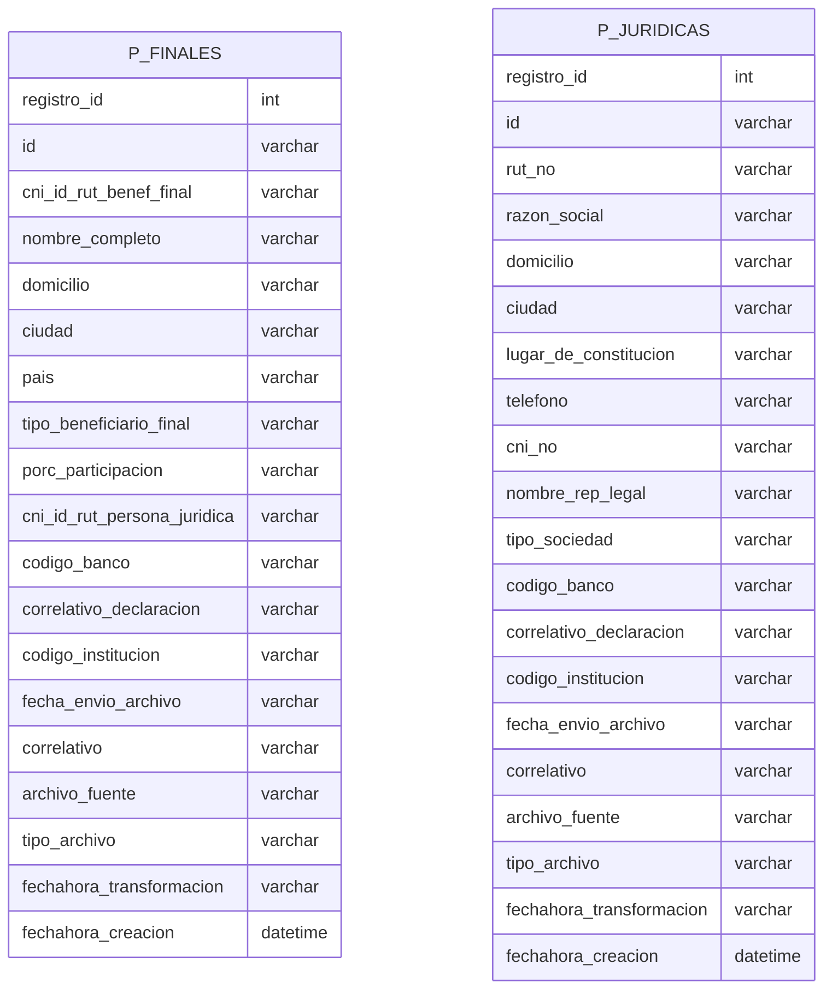

```mermaid

erDiagram

  P_FINALES {
      registro_id int
      id varchar
      cni_id_rut_benef_final varchar
      nombre_completo varchar
      domicilio varchar
      ciudad varchar
      pais varchar
      tipo_beneficiario_final varchar
      porc_participacion varchar
      cni_id_rut_persona_juridica varchar
      codigo_banco varchar
      correlativo_declaracion varchar
      codigo_institucion varchar
      fecha_envio_archivo varchar
      correlativo varchar
      archivo_fuente varchar
      tipo_archivo varchar
      fechahora_transformacion varchar
      fechahora_creacion datetime
  }

  P_JURIDICAS {
      registro_id int
      id varchar
      rut_no varchar
      razon_social varchar
      domicilio varchar
      ciudad varchar
      lugar_de_constitucion varchar
      telefono varchar
      cni_no varchar
      nombre_rep_legal varchar
      tipo_sociedad varchar
      codigo_banco varchar
      correlativo_declaracion varchar
      codigo_institucion varchar
      fecha_envio_archivo varchar
      correlativo varchar
      archivo_fuente varchar
      tipo_archivo varchar
      fechahora_transformacion varchar
      fechahora_creacion datetime
  }

```