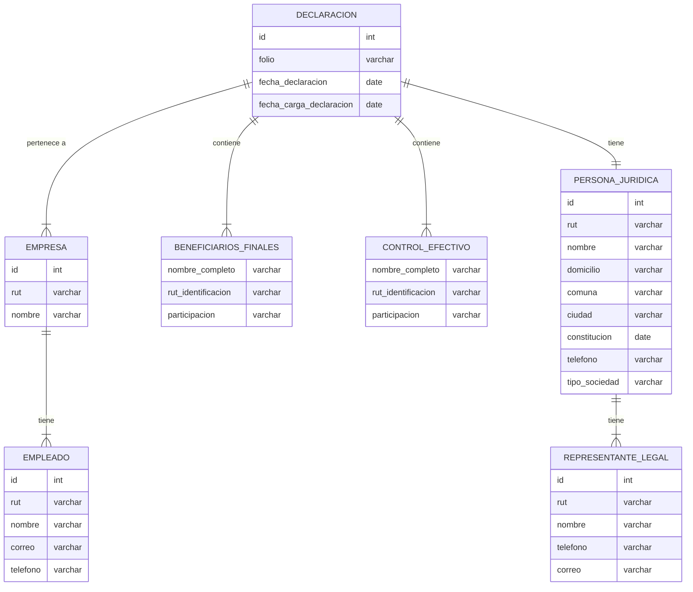

```mermaid

erDiagram

  DECLARACION ||--|{ EMPRESA : "pertenece a"
  EMPRESA ||--|{ EMPLEADO : "tiene"
  DECLARACION ||--|{ BENEFICIARIOS_FINALES : "contiene"
  DECLARACION ||--|{ CONTROL_EFECTIVO : "contiene"
  DECLARACION ||--|| PERSONA_JURIDICA : "tiene"
  PERSONA_JURIDICA ||--|{ REPRESENTANTE_LEGAL : "tiene"

  DECLARACION {
    id int
    folio varchar
    fecha_declaracion date
    fecha_carga_declaracion date
  }
  
  EMPRESA {
    id int
    rut varchar
    nombre varchar
  }

  EMPLEADO {
    id int
    rut varchar
    nombre varchar
    correo varchar
    telefono varchar
  }

  BENEFICIARIOS_FINALES {
    nombre_completo varchar
    rut_identificacion varchar
    participacion varchar
  }

  CONTROL_EFECTIVO {
    nombre_completo varchar
    rut_identificacion varchar
    participacion varchar
  }

  PERSONA_JURIDICA {
    id int
    rut varchar
    nombre varchar
    domicilio varchar
    comuna varchar
    ciudad varchar
    constitucion date
    telefono varchar
    tipo_sociedad varchar
  }

  REPRESENTANTE_LEGAL {
    id int
    rut varchar
    nombre varchar
    telefono varchar
    correo varchar
  }

```